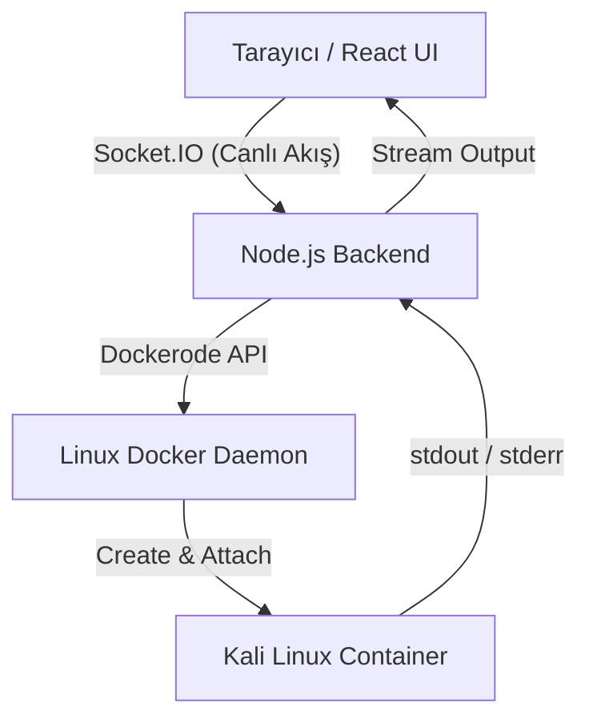
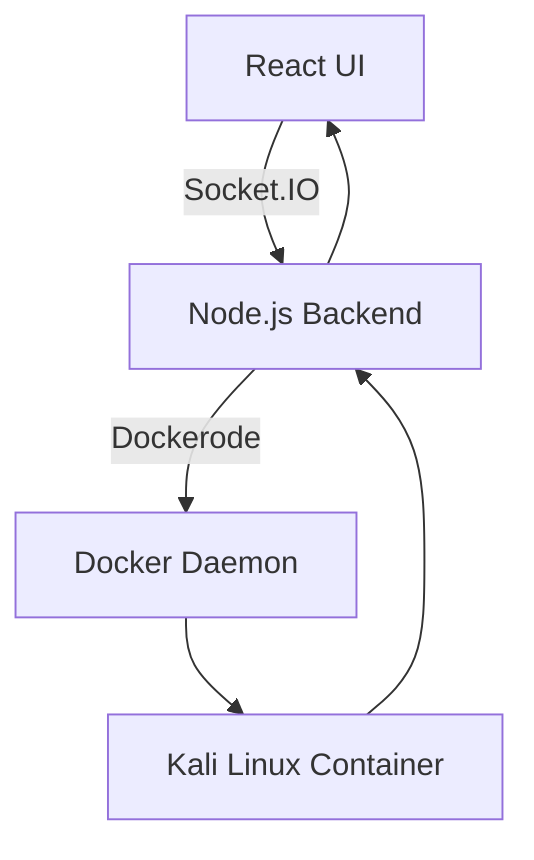

# 🚀 Linux Web Terminal (Dockerized)

🌍 **Language / Dil**
- [🇹🇷 Türkçe](#-türkçe)
- [🇬🇧 English](#-english)

---
## Türkçe

Bu proje, tarayıcı üzerinden **gerçek ve izole bir Kali Linux** terminaline erişim sağlayan
**full-stack** bir web uygulamasıdır.

Sıradan bir CSS/JS simülasyonu **değildir**.  
Arka planda **Docker API** kullanılarak her kullanıcı için sıfırdan canlı bir Linux container oluşturulur
ve **WebSocket (Socket.IO)** üzerinden gerçek zamanlı veri akışı sağlanır.


---

### 🏗️ Mimari ve Çalışma Mantığı

Proje **Client–Server** mimarisi üzerine kuruludur.  
Geliştirme ortamında **Frontend (Windows / macOS)** ve **Backend (Linux Sunucu)**
farklı makinelerde çalışabilecek şekilde tasarlanmıştır.




### 🔄 İşleyiş

- **Frontend**: Kullanıcı komutu web terminal üzerinden girer (xterm.js)
- **Backend**: Komutu alır ve Linux sunucudaki Docker Socket’e iletir
- **Docker**: Komutu izole bir container içinde çalıştırır
- **Çıktı**: stdout / stderr gerçek zamanlı olarak kullanıcıya aktarılır

### 🛠️ Teknoloji Yığını (Tech Stack)

#### Backend (Server-Side)

- Node.js & Express – API ve sunucu yönetimi
- Dockerode – Docker Daemon ile Node.js üzerinden iletişim
- Socket.IO – Düşük gecikmeli çift yönlü iletişim

#### Frontend (Client-Side)

- React (Vite) – Modern ve hızlı arayüz geliştirme
- xterm.js – Web tabanlı terminal emülasyonu
- xterm-addon-fit – Responsive terminal boyutlandırma


#### ⚠️ Ön Gereksinimler (Prerequisites)

Backend’in çalışacağı Linux makinede aşağıdakiler kurulu olmalıdır:
- Node.js (v16+)
- Docker Engine (çalışır durumda)

#### Gerekli Docker İmajı : 
```bash
docker pull kalilinux/kali-rolling
```

⚠️ Not: Backend servisi, Linux sistemindeki /var/run/docker.sock dosyasına erişim yetkisine sahip olmalıdır.


### 🚀 Kurulum ve Çalıştırma

#### 1️⃣ Projeyi Klonlayın
```bash
git clone https://github.com/Ahmet-KURKCU/Linux-Web-Terminal.git
cd Linux-Web-Terminal
```

#### 2️⃣ Backend’i Başlatma (Linux Sunucu)
```bash
cd backend
npm install
node server.js
```

> Konsolda backend sunucusu çalışıyor benzeri bir çıktı görmelisiniz.

#### 3️⃣ Frontend’i Başlatma (Local / Windows)
```bash
cd frontend
npm install
npm run dev
```
### 🔒 Güvenlik Notu

Bu proje eğitim ve portföy amaçlı geliştirilmiştir.
Production ortamında kullanılmadan önce aşağıdaki önlemlerin eklenmesi şiddetle önerilir:

- Kullanıcı kimlik doğrulama (Authentication)
- Rate Limiting (DDOS / brute-force koruması)
- Container CPU / RAM kullanım limitleri
- Komut filtreleme ve loglama


### 👨‍💻 Geliştirici

Bu proje, Web Teknolojileri ile Linux / Docker sistem programlama
entegrasyonunu göstermek amacıyla geliştirilmiştir.


## English

This project is a full-stack web application that allows users to access a real, fully isolated Kali Linux terminal directly from their web browser.

Unlike basic web-based terminal demos, this application does not rely on CSS or JavaScript simulations.
Instead, every user session is backed by a real Linux environment, running inside its own Docker container.

Each container is dynamically created using the Docker API, ensuring isolation and security between users.
All terminal input and output are transmitted in real time using WebSocket technology (Socket.IO), providing a smooth and responsive terminal experience similar to a native SSH session.

### 🏗️ Architecture Overview

The project is built on a **Client–Server** architecture, separating the user interface from the system-level operations.

**The Frontend (running on Windows or macOS)** handles the user interface and terminal rendering,
while **the Backend (running on a Linux server)** manages Docker containers and command execution.

This design allows the frontend and backend to operate on different machines, making the system flexible and scalable.



### 🔄 Workflow
- **Frontend**: The user enters Linux commands through a web-based terminal interface powered by xterm.js.
- **Backend**: The backend receives these commands and forwards them to the Docker Engine using the Docker API.
- **Docker**: Commands are executed inside a dedicated, isolated Kali Linux container.
- **Output**: The container’s stdout and stderr streams are sent back to the backend and streamed to the browser in real time.

### 🛠️ Tech Stack

#### Backend
- Node.js & Express – Handles server logic and API operations
- Dockerode – Enables communication with the Docker Daemon from Node.js
- Socket.IO – Provides low-latency, bidirectional real-time communication

#### Frontend
- React (Vite) – Builds a fast and modern user interface
- xterm.js – Renders a fully interactive terminal in the browser
- xterm-addon-fit – Automatically resizes the terminal to fit the screen

### ⚠️ Prerequisites

The backend must run on a Linux server with the following requirements:

- Node.js (v16 or higher)
- Docker Engine (installed and running)
- Required Docker image: 
```bash 
docker pull kalilinux/kali-rolling
```
- The backend service must also have permission to access the Docker socket: /var/run/docker.sock


### 🚀 Installation
#### 1️⃣ Clone the Repository
```bash
git clone https://github.com/Ahmet-KURKCU/Linux-Web-Terminal.git
cd Linux-Web-Terminal
```
#### 2️⃣ Backend (Linux)
```bash
cd backend
npm install
node server.js
```
#### 3️⃣ Frontend (Local Machine)
```bash
cd frontend
npm install
npm run dev
```

### 🔒 Security Notice

This project is developed for educational and portfolio purposes.

Before deploying it in a production environment, it is strongly recommended to implement additional security measures such as:

- User authentication and authorization
- Rate limiting to prevent abuse
- CPU and RAM limits for Docker containers
- Command filtering and activity logging


### 👨‍💻 Developer

This project was developed to demonstrate the integration of modern web technologies with Linux system programming and Docker-based containerization.

It showcases how browser-based applications can securely interact with real Linux environments by combining frontend development, backend services, and container orchestration into a single, cohesive system.